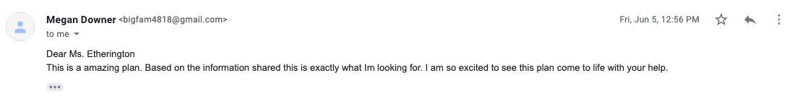

Planning
==

Definition of the Problem
---
Maggie Downer is creating an educational program to teach young people about First Nations and Indigenous American (FNAI) cultures in Canada. She wants the program to be widely available to a lot of people and sees a webiste as her way to do this. This website will need to act as both promotional material for people to get information on the program, as well as a space where she can upload the actual program and lessons for registered users. This means that the website will have a public section and a login-protected section to satisfy both of these needs. Additionally, since Ms. Downer is not finished developing the course, she wants to be able to login as an administrator to edit and change the information on the website at any time after the development is complete. The program is split up into units and lessons, so Ms. Downer wants the website to have the same design. Users should be able to work their way through individual lessons and units, and save their progress for later sessions. Finally, Ms. Downer wants the learning to be as dynamic as possible for the students, so she wants to be able to easily embed links and images into her lesson content.

*Fig 1. Evidence of communication with the client*

Rational for Proposed Solution
--
Since I will be creating a website, I will use a combination of HTML, CSS, and Javascript to fulfill my client's needs. There will be two main websites that can be switched between using a navigation bar: a promotional one and the one that features the educational content. The educational content will be login-protected, while the promotional site will be public. For the lesson content, I will use PHP and PostgreSQL database software to record each lesson, as well as keep track of all registered users and admins. While there are more modern options like Flask programming available, this traditional method is the most widely used so they have more documentation and user resources. 

For now, I will host the site on a local server. This will let me perform alpha testing and give the user video updates of the product. However, as the client is on a different network, they will be unable to access it. Therefore, once the project is ready to be shown to the client, I will likely use a commercial server like Amazon Cloud because it is cheap and reliable and will let the user access the site from anywhere. This will also let potential students access the site.

Success Criteria
--

After discussing the product with the client over the phone, I developped the following success criteria: 

* The main website will have three pages:
    * Home
    * About
    * Register / Contact
* There is a space where registered users can login as either a user or an administrator
* The login protected page student page includes:
    * A welcome page with the completion progress
    * Lessons divided by units that can be saved by the user
  * The login protected user page includes:
    * The ability to edit or delete lessons and units
    * The ability to add new units
    * The ability to add new lessons that:
      * Contain a title and text
      * Can include photos and videos
      * Can include links
