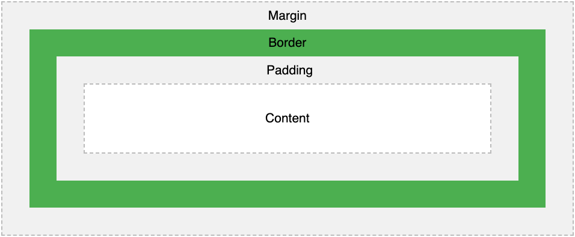
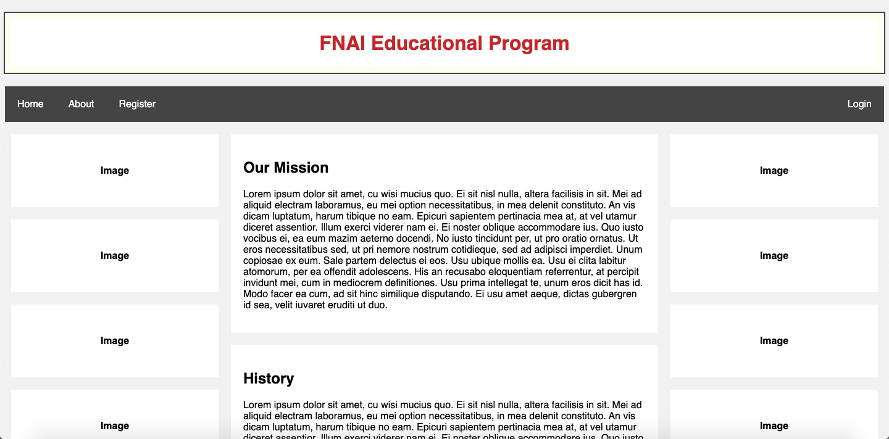
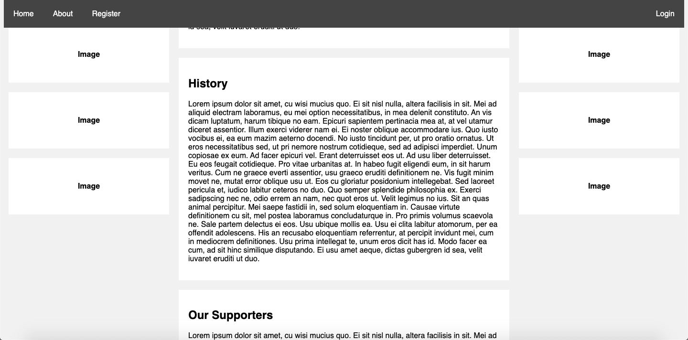

Development
=
**Div**
The `div` element is a block-level element in HTML. For this project, it is used as a container for other elements.

**Box Model:**
The box model demonstrates the various parts of an element in CSS. It is shown in the picture below.


[[1](#Sources)]

By controlling the padding, border, and margin, the space around the content of the box can be changed.

**Flexbox:**
The flexbox technique is a method of organizing HTML objects. By setting up a `div` element with the `display: flex` property, the element becomes a flex container. `dev` elements can then be put in the container. Flexbox is used to organize the entire site. The containers are organized by the class `row` and the elements are broken into two sub-classes: `column.main` and `column.sidebar`. The CSS for these elements is as follows:

```.CSS
.row{
  display: flex;
}

.column{
  float: left;
  padding-right: 10px;
  padding-left: 10px;
}

.column.main{
  width: 75%;
}

.column.sidebar{
  width: 25%;
}
```

Within the columns, there are sections of text:
```.CSS
.section {
  background-color: white;
  margin-top: 20px;
  padding: 20px;
}
```

**Sticky Positioning**
There are many types of positioning: static, relative, fixed, and absolute. In 2016, sticky positioning was introduced. [[2](#Sources)] This means that when an element is scrolled past, it "sticks" to a specific part of the screen. The navigation bar on this site uses sticky positioning:

```.CSS
.nav_bar{
  overflow: hidden;
  position: sticky;
  top: 0;
  position: -webkit-sticky;
```

It looks like this:






**List**
There are two types of lists in HTML:
* Ordered list
* Unordered list

On this site, an ordered list is used in the sidebar:
```.CSS
<ol>
    <li>
        Unit Name
        <ol class="sublist">
            <li>Lesson Name</li>
            <li>Lesson Name</li>
            <li>Lesson Name</li>
        </ol>
    </li>
    <li>
        Unit Name
        <ol class="sublist">
            <li>Lesson Name</li>
            <li>Lesson Name</li>
            <li>Lesson Name</li>
        </ol>
    </li>
</ol>
```
And looks like this:

<ol>
    <li>
        Unit Name
        <ol class="sublist">
            <li>Lesson Name</li>
            <li>Lesson Name</li>
            <li>Lesson Name</li>
        </ol>
    </li>
    <li>
        Unit Name
        <ol class="sublist">
            <li>Lesson Name</li>
            <li>Lesson Name</li>
            <li>Lesson Name</li>
        </ol>
    </li>
</ol>


**Link**

To add a link with HTML, the following code is used: `<a href='link'>Word<a>`

**Screen Size Adjustment**

To make a responsive webpage, it's important to keep in mind the size of the screen. The following code changes the flexbox setup so that the columns are stacked on top of one another if there is not enough space to put them side by side.

```.CSS
@media screen and (max-width: 600px) {
    .column.sidebar, .column.main {
        width: 100%;
    }
}
```

**Form**

**Keyframe Animation**

**Hover**


Sources
-
1. CSS Box Model. (n.d.). Retrieved August, 2020, from https://www.w3schools.com/css/css_boxmodel.asp
2. Shechter, E. (2020, March 04). CSS Position Sticky - How It Really Works! Retrieved August 29, 2020, from https://medium.com/@elad/css-position-sticky-how-it-really-works-54cd01dc2d46 
